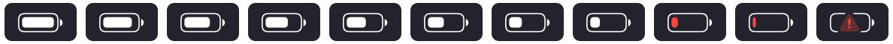
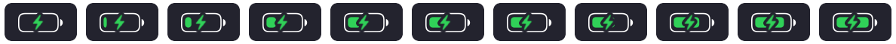
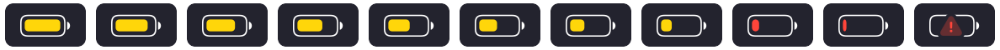
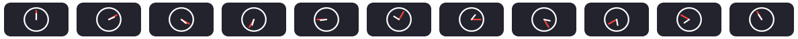

# sketchybar-icons

Render **native macOS Battery / Wi-Fi icons** (and any SF Symbol) to PNG files for
[SketchyBar](https://github.com/FelixKratz/SketchyBar) — **without** the
`alias` feature, so your bar no longer needs Screen Recording permission.

## Gallery

<!-- Widths are proportional to each strip's tile count so every icon renders
     the same size (battery + clock rows have 11 tiles = 100%; wifi and system
     rows have 6 = ~54.5%). -->

Battery discharging — continuous fill, red when low, warning triangle when critical:



Battery charging — real level under a bolt with a knocked-out halo:



Low Power Mode — the bar turns yellow (still red when low, warning when critical):



Wi-Fi — Personal Hotspot, then arcs filling by live RSSI, disconnected, and off:


Clock — a hand-drawn analog face with real minute-hand precision (red minute hand):



Control Center + Volume — the `switch.2` toggles and the macOS `speaker.*` family
(muted, then 0→3 waves), rendered all-white to drop the Nerd-Font dependency:


> Prefer not to build anything? Grab a ready-made PNG set from the
> [latest release](https://github.com/xav-ie/sketchybar-icons/releases/latest).

## Why

SketchyBar's `alias` items (`"Control Center,Battery"`, `"Control Center,WiFi"`)
work by **continuously screen-capturing** the real macOS menu-bar items. That's
the reason SketchyBar shows up as "recording your screen" — and it burns more
power than drawing a glyph.

`sketchybar-icons` renders Apple's own SF Symbols to PNGs instead, so you get
pixel-native Battery/Wi-Fi icons with zero screen capture. It also reads live
Wi-Fi signal via CoreWLAN (no Location permission needed) and draws a
continuous-fill battery that SF Symbols can't produce on its own.

## Subcommands

```
sketchybar-icons symbol  --symbol <name> [--value 0..1] [--point-size N] [--scale N]
                         [--min-width pts] [--x-shift pts]
                         [--color 0xAARRGGBB] [--palette h,h,...] --out <path>

sketchybar-icons wifi    # prints: power=on associated=yes rssi=-56 fraction=0.83

sketchybar-icons battery --level 0..1 [--charging true|false] [--warn true|false]
                         [--point-size N] [--scale N] [--weight thin|regular|...]
                         [--color 0xAARRGGBB] --out <path>

sketchybar-icons clock   --hour 0..23 --minute 0..59 [--point-size N] [--scale N]
                         [--color 0xAARRGGBB] [--minute-color 0xAARRGGBB] --out <path>
```

- **`symbol`** — any SF Symbol → PNG. `--value` drives `variableValue` (e.g. the
  `wifi` symbol fills its arcs by signal). `--min-width`/`--x-shift` pad/center
  the glyph in the canvas (SketchyBar left-aligns background images).
- **`wifi`** — live Wi-Fi state from CoreWLAN. Uses only RSSI/power (never the
  SSID), so it needs **no** Location permission. `fraction` is RSSI mapped to
  0…1 (~-50 dBm → 1.0, ~-85 dBm → 0.0).
- **`battery`** — a macOS-style battery: Apple's `battery.0` outline with a
  **continuous proportional fill** (SF only has 0/25/50/75/100, and its battery
  `variableValue` is inert). `--charging` overlays a bolt with a uniform halo
  gap; `--warn` overlays a low-battery warning triangle. The fillable interior
  is measured from the rendered outline so it stays symmetric at any size/weight.
- **`clock`** — an analog clock face at `--hour`/`--minute`. SF Symbols has no
  time-aware clock (its `clock`/`deskclock` glyphs are frozen poses, with no
  hour-specific family), so the face is drawn directly with CoreGraphics in SF's
  optical style (bare ring, rounded caps). Gives real **minute-hand precision**,
  which the discrete Nerd-Font `clock_time_*` glyphs can't. `--color` tints the
  ring + hour hand; `--minute-color` tints the minute hand (defaults to
  `--color`).

All rendering happens on demand — cache the PNGs by state and you re-render only
when the icon changes (vs. the alias's constant capture).

## Examples

```sh
# Wi-Fi at 66% signal, white, retina, centered in a 29pt-wide button
sketchybar-icons symbol --symbol wifi --value 0.66 --point-size 14 --scale 2 \
  --min-width 29 --x-shift 0.75 --color 0xffffffff --out ~/.cache/sketchybar/wifi.png

# Battery at 90%, discharging, thin outline, white
sketchybar-icons battery --level 0.90 --point-size 18 --scale 2 --weight thin \
  --color 0xffffffff --out ~/.cache/sketchybar/battery.png

# Charging at 45%, green with bolt
sketchybar-icons battery --level 0.45 --charging true --point-size 18 --scale 2 \
  --weight thin --color 0xff30d158 --out ~/.cache/sketchybar/battery.png

# Analog clock at 10:08, white face with a red minute hand
sketchybar-icons clock --hour 10 --minute 8 --point-size 18 --scale 2 \
  --color 0xffffffff --minute-color 0xffff453a --out ~/.cache/sketchybar/clock.png

# Control Center (switch.2) and volume (speaker.*) — plain SF Symbols, all-white.
# `--palette` (not `--color`) keeps every layer solid instead of hierarchical-dimmed.
sketchybar-icons symbol --symbol switch.2 --point-size 14 --scale 2 \
  --palette 0xffffffff,0xffffffff,0xffffffff --out ~/.cache/sketchybar/control-center.png
sketchybar-icons symbol --symbol speaker.wave.2.fill --point-size 12 --scale 2 \
  --palette 0xffffffff,0xffffffff,0xffffffff,0xffffffff --out ~/.cache/sketchybar/volume.png
```

Point the item at the PNG:

```sh
sketchybar --set battery icon.background.image="$HOME/.cache/sketchybar/battery.png" \
                         icon.background.image.scale=0.5 icon.background.drawing=on
```

### Example plugins

See [`examples/`](./examples) for Nushell plugins (`battery_icon.nu`, `wifi.nu`)
that wire this into SketchyBar — including driving Wi-Fi off the
`com.apple.system.config.network_change` distributed notification and battery off
`pmset -g pslog`.

## Install (Nix)

```nix
# flake.nix
inputs.sketchybar-icons.url = "github:xav-ie/sketchybar-icons";

# then, on darwin:
inputs.sketchybar-icons.packages.${system}.default
```

Or build/run directly:

```sh
nix run github:xav-ie/sketchybar-icons -- battery --level 0.5 --out /tmp/b.png
```

### Without Nix

```sh
swiftc -O *.swift -o sketchybar-icons   # macOS, Swift toolchain
```

## License

MIT
